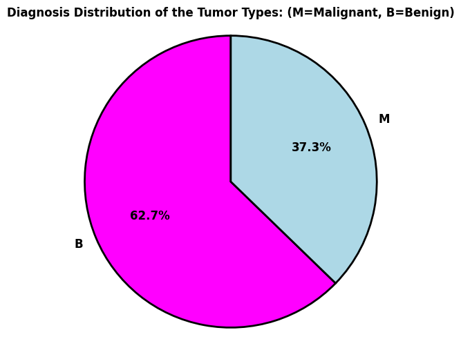
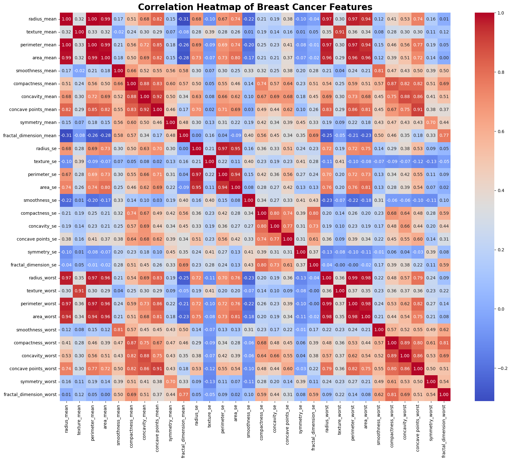
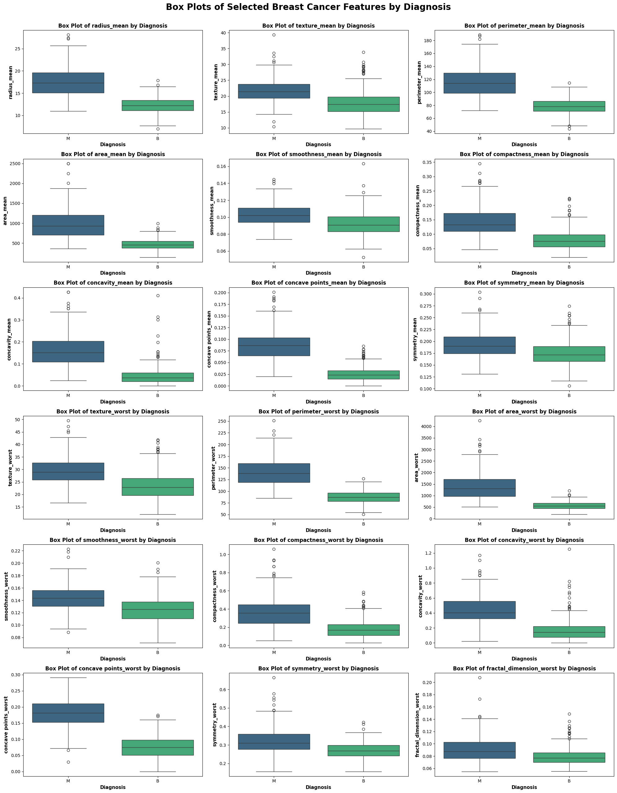
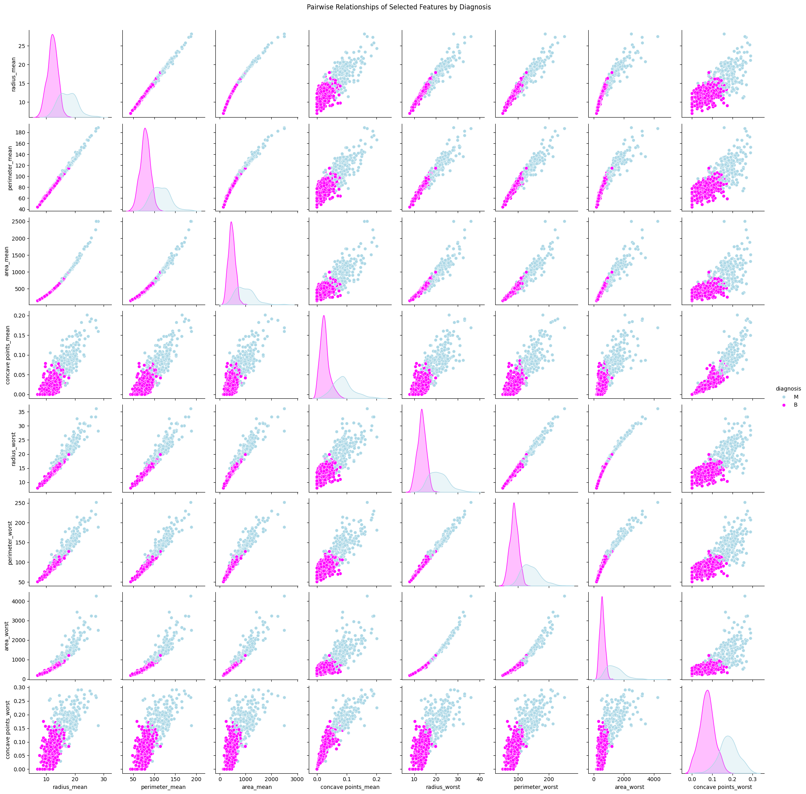

# 🩺 EDA PROJECT 2:
#  Unveiling Insights for Breast Cancer Diagnosis: An Exploratory Data Analysis

## 📌 Project Overview
This project represents a focused effort to conduct an in-depth Exploratory Data Analysis (EDA) on a vital Breast Cancer Diagnosis dataset. My goal is to move beyond surface-level statistics and truly understand the intricate characteristics that distinguish benign (non-cancerous) from malignant (cancerous) tumors, utilizing features derived from digitized images of fine needle aspirates (FNA). Through meticulous data inspection, cleaning, and compelling visualizations, I aim to uncover critical patterns and relationships. These insights are not merely academic; they are the foundational steps in building a robust predictive model, a tool that holds the potential to contribute to more accurate and timely breast cancer diagnoses. This project is a personal commitment to leveraging data science for impactful contributions in healthcare.

This project is part of my **data science portfolio**

---

## 🧰 Tools & Libraries
- **Python** (Jupyter Notebook)  
- **pandas** and **numpy** for data wrangling  
- **matplotlib** and **seaborn** for visualization
- **GitHub** for portfolio showcase

---

## 🔍 Key Analysis Steps
1. **Data Inspection**
   - Dataset contains **569 samples** and **33 features** (including ID and diagnosis).
   - One column (`Unnamed: 32`) contained no values and was dropped.
   - Identified datatype mismatches across numeric and categorical fields.

2. **Data Cleaning**
   - Removed redundant/unnecessary columns.  
   - Checked for and handled missing/empty values.  

3. **Exploratory Visualizations**
   - Class distribution between benign and malignant tumors.
   - Correlation heatmap of all features.  
   - Boxplots of critical features across diagnosis classes.  
   - Pairplots of selected features to study separability.  
   - And so on.
---

## 📊 Insights
- **Class Distribution:** The dataset is slightly imbalanced but still workable for modeling.  
- **Correlated Features:** Strong relationships exist among *radius, perimeter, and area* features, which may influence feature selection.  
- **Scaling Needs:** Features have widely varying ranges, highlighting the need for scaling before predictive modeling.  
- **Feature Separability:** Certain features (e.g., `concave points_worst`, `area_worst`) strongly separate benign vs malignant tumors.  

---

## 📸 Sample Visuals from the Notebook  

| Class Distribution | Correlation Heatmap |
|--------------------|---------------------|
|  |  |

| Boxplot of Features | Pairplot of Key Features |
|----------------------|--------------------------|
|  |  |

---

## 📁 Files in This Repository
- `EDA_Project2.ipynb`: Jupyter notebook with full exploratory analysis  
- `Images/`: Folder containing exported plots used in README  
- `Data/`: Folder with sample CSVs (dataset uploaded here)  

---

## 📂 Dataset Access
You can download it here:  
👉 [Breast Cancer Wisconsin (Diagnostic) Dataset on Kaggle](https://www.kaggle.com/datasets/wasiqaliyasir/breast-cancer-dataset)  

---

## 📊 Key Findings and Significant Implications for the development of a Predictive Model

**Based on the Exploratory Data Analysis of the Breast Cancer Diagnosis dataset, some of the key findings and implications for building a predictive model are as follows:**

- The dataset exhibits class imbalance, with significantly more benign cases than malignant ones, which will require consideration during model training (e.g., using techniques like stratification, resampling, or adjusting class weights).
- Many features show distinct distributions and significantly different mean and median values between benign and malignant tumors, particularly features related to the size and irregularity of cell nuclei (radius, perimeter, area, concave points, and their 'worst' counterparts). These features are likely to be strong predictors of diagnosis.
- High correlations exist among many features, especially within the 'mean' and 'worst' groups, suggesting potential multicollinearity. This might necessitate feature selection or dimensionality reduction techniques to improve model stability and interpretability.
- The differential correlation analysis revealed that the relationships between some feature pairs change significantly between benign and malignant tumors, providing further discriminatory information that a model could leverage.
- The presence of outliers, especially in malignant cases for certain features, indicates data variability and might require robust preprocessing steps or models less sensitive to extreme values.
- The clear separation observed in pairwise plots for several feature combinations reinforces their potential as powerful discriminators for classifying tumor type.

**Overall, the EDA suggests that a predictive model should focus on features related to cell morphology and nuclear characteristics, while also addressing class imbalance and potential multicollinearity to achieve accurate and reliable breast cancer diagnosis prediction.**

---

## 🚀 Next Steps
- Build baseline ML classifiers (Logistic Regression, Random Forest, XGBoost).  

---
## ✍️ Author
**Dr. Adebayo Fashina**  
📍 Toronto, Canada | [LinkedIn](https://www.linkedin.com/in/your-link-here)  

